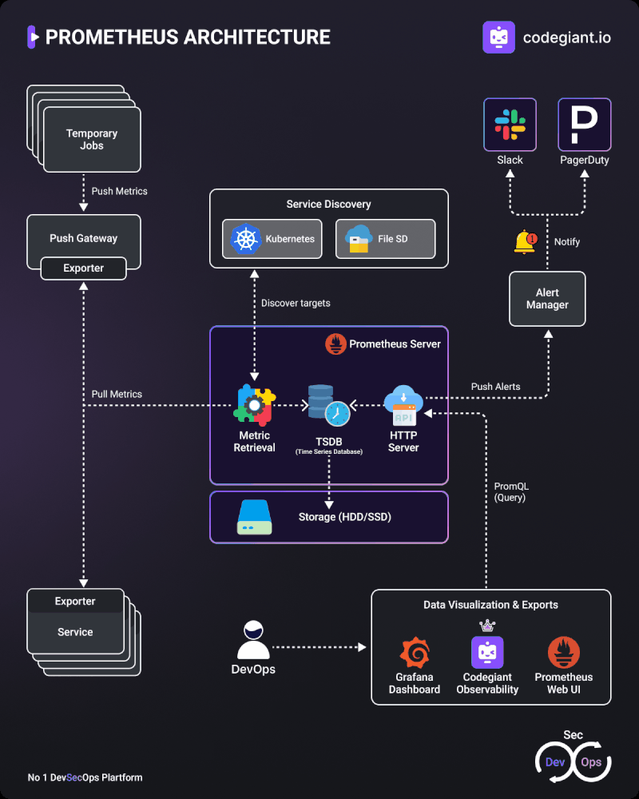

## **Devops Tools**


### Get the oc client download URL

Go to this [link](https://github.com/openshift/okd/releases) to get your desired version of the OC client tool. I have choosen the latest version available in July, 2020.

https://github.com/openshift/okd/releases/download/4.5.0-0.okd-2020-07-14-153706-ga/openshift-client-linux-4.5.0-0.okd-2020-07-14-153706-ga.tar.gz

### Download the package

```bash
wget https://github.com/openshift/okd/releases/download/4.5.0-0.okd-2020-07-14-153706-ga/openshift-client-linux-4.5.0-0.okd-2020-07-14-153706-ga.tar.gz
```

### Extract the package

```bash
tar -xvf openshift-client-linux-4.5.0-0.okd-2020-07-14-153706-ga.tar.gz
```

### Move oc and kubectl file to your expected directory

```bash
sudo mv oc kubectl /usr/local/bin/
```

### Now you can start using OC command

```bash
oc version
```

**You may need to add the installation path in your bash profile**

### **working with db using OpenStack oc CLI**

'


```bash
oc create -f 
https://raw.githubusercontent.com/openshift-labs/starter-guides/ocp-4.8/mongodb-template.yaml -n {your-namespace}
```
```bash
oc new-app --template=mongodb-ephemeral --param MONGODB_USER=genuser --param MONGODB_PASSWORD=password --param MONGODB_DATABASE=namegen --param NAMESPACE={your-namespace}
```

```bash
oc import-image mongodb:3.6 
--from=registry.access.redhat.com/rhscl/mongodb-36-rhel7 --confirm -n {your-namespace}
```

### About these parameters:

**--template=mongodb-persistent**  declares the OpenShift template to use, in this case the mongodb-persistent template. The mongodb-persistent template creates a Kubernetes persistent volume claim (PVC) for storing database data. The data stored in the PVC will remain available even if the instance of the MongoDB database is removed from the Developer Sandbox for Red Hat OpenShift. 

**--param=MONGODB_USER=genuser** declares the name of the MongoDB user who will be reading and writing to the instance of the MongoDB database running in the Developer Sandbox for Red Hat OpenShift. 
**--param=MONGODB_PASSWORD=password** declares the password for the MongoDB user who will be reading and writing to the instance of the MongoDB database running in the Developer Sandbox for Red Hat OpenShift. 
**--param=MONGODB_DATABASE=namegen** declares the name of the database in the MongoDB instance that will be created to store data for the demonstration application.

### **Installing the OpenShift Pipelines Operator using the CLI**

```yaml

apiVersion: operators.coreos.com/v1alpha1
kind: Subscription
metadata:
  name: openshift-pipelines-operator
  namespace: openshift-operators
spec:
  channel:  <channel name> 
  name: openshift-pipelines-operator-rh 
  source: redhat-operators 
  sourceNamespace: openshift-marketplace 

  ```
### Prometheus Architecture
- Prometheus is a popular open-source monitoring system with the following key components:
- Prometheus Server: Collects and stores metrics
- Exporters: Expose metrics from systems and applications
- Pushgateway: Allows pushing metrics from short-lived jobs
- Alertmanager: Handles alerts generated by Prometheus
- Grafana: Provides dashboards for visualizing metrics



### Setting Up Chef

- Install Chef Server and Client On the Chef Server node:

- Download and install Chef Server:

```bash
wget https://packages.chef.io/files/stable/chef-server/14.2.2/ubuntu/20.04/chef-server-core_14.2.2-1_amd64.deb
sudo dpkg -i chef-server-core_14.2.2-1_amd64.deb
```
- Start and configure Chef Server:

```bash
sudo chef-server-ctl reconfigure
```

- Create a user and organization:

```bash
sudo chef-server-ctl user-create USER_NAME FIRST_NAME LAST_NAME EMAIL 'PASSWORD' --filename /path/to/USER_NAME.pem
sudo chef-server-ctl org-create ORG_NAME 'ORG_FULL_NAME' --association_user USER_NAME --filename /path/to/ORG_NAME-validator.pem
```
- Some Times the .chef file created is owned by the user account not the root user, To resolve that we need to change the permission of the directory

```bash
mkdir -p ~/.chef
sudo chown $USER:$USER ~/.chef
chmod 700 ~/.chef
```
```bash
sudo mv chefadmin.pem ~/.chef/
sudo chown $USER:$USER ~/.chef/chefadmin.pem
chmod 600 ~/.chef/chefadmin.pem
```
- Configure Your User Credentials File
Your .chef directory contains a credentials file used to communicate with the Chef Infra Server. You can generate this file by running knife configure and following the prompts.

The knife configure command requires the following values:

- Chef Server URL: the full URL to your Chef Infra Server including the org
- Client Name: the client name your server administrator created for you
Your Chef administrator should provide this information. For Hosted Chef or Chef Manage, you can find this information in the Starter Kit file. Download the file on the Manage site by navigating to the Administration tab and selecting Starter Kit. (Manage > Administration > Starter Kit > Download Starter Kit)

Find the .chef/config.rb file in the Starter Kit. It should look like:
**If you're running the Chef server on the same machine as your workstation, you can use https://localhost**
```bash
current_dir = File.dirname(__FILE__)
log_level                :info
log_location             STDOUT
node_name                'bismark'
client_key               "#{current_dir}/chefadmin.pem"
validation_client_name   'myorg-validator'
validation_key           "#{current_dir}/myorg-validator.pem"
chef_server_url          'https://localhost/organizations/myorg'
cookbook_path            ["#{current_dir}/../cookbooks"]
```
- On the Chef Client node:

```bash
wget https://packages.chef.io/files/stable/chef/17.10.0/ubuntu/20.04/chef_17.10.0-1_amd64.deb
sudo dpkg -i chef_17.10.0-1_amd64.deb
```
- Create a client configuration file:
Create a file named client.rb in the /etc/chef/ directory:
```bash
sudo mkdir -p /etc/chef
sudo nano /etc/chef/client.rb
```
- Add the following content to the file:
```ruby
chef_server_url 'https://localhost/organizations/myorg'
validation_client_name 'myorg-validator'
validation_key '/home/bismark/.chef/myorg-validator.pem'
node_name 'adorsys'  // or whatever name you want for this node
#you may run into a problem of the Chef client is unable to connect to the Chef server due to an SSL certificate verification failure. This is likely because your Chef server is using a self-signed certificate, which is not trusted by default. To resolve this issue, you need to either add the self-signed certificate to the trusted certificates or disable SSL verification
#ssl_verify_mode :verify_none 
```
- Copy the validator key:
```bash
sudo cp /home/bismark/.chef/myorg-validator.pem /etc/chef/
```
- Set proper permissions:
- Ensure that the Chef client can read these files:
```bash
sudo chown root:root /etc/chef/client.rb /etc/chef/myorg-validator.pem
sudo chmod 644 /etc/chef/client.rb
sudo chmod 600 /etc/chef/myorg-validator.pem
```
- Install Chef Workstation:
Chef Workstation includes the chef command and other tools necessary for cookbook development. Here's how to install it:
bash
- Download Chef Workstation
```bash
 https://packages.chef.io/files/stable/chef-workstation/21.10.640/ubuntu/20.04/chef-workstation_21.10.640-1_amd64.deb
```
- Install the package
```bash
 dpkg -i chef-workstation_21.10.640-1_amd64.deb
```
- If there are any dependency issues, run:
```bash
 apt-get install -f
```
Note: The version number (21.10.640) might change. Check the Chef Workstation downloads page for the latest version.
Verify the installation:
- After installation, verify that the chef command is available:
```bash
chef --version
```
- Generate the cookbook:
```bash
chef generate cookbook starter
```
- Configure knife:
If you haven't already, you'll need to configure knife to communicate with your Chef server. Create or edit ~/.chef/knife.rb:
```ruby
current_dir = File.dirname(__FILE__)
log_level                :info
log_location             STDOUT
node_name                "your_username"
client_key               "#{current_dir}/your_username.pem"
chef_server_url          "https://your_chef_server_url/organizations/your_org"
cookbook_path            ["#{current_dir}/../cookbooks"]
```
Replace the placeholders with your actual information.
- Upload the cookbook:
After generating the cookbook, you can upload it to the Chef server:
```bash
knife cookbook upload starter
```
Run chef-client:
Now you should be able to run chef-client with the starter cookbook:
```bash
sudo chef-client --runlist 'recipe[starter]'
```
```ruby
Synchronizing cookbooks:
  - starter (0.1.0)
Installing cookbook gem dependencies:
Compiling cookbooks...
Loading Chef InSpec profile files:
Loading Chef InSpec input files:
Loading Chef InSpec waiver files:
Converging 1 resources
Recipe: starter::default
  * file[/tmp/hello.txt] action create
    - create new file /tmp/hello.txt
    - update content in file /tmp/hello.txt from none to 315f5b
    --- /tmp/hello.txt  2024-07-28 03:44:46.332189686 +0100
    +++ /tmp/.chef-hello20240728-105433-ma7h6t.txt      2024-07-28 03:44:46.332189686 +0100
    @@ -1 +1,2 @@
    +Hello, world!

Running handlers:
Running handlers complete
```
### Enable the Puppet platform repository

- Apt is used with Debian and Ubuntu. Go to apt.puppet.com for a list of packages and corresponding URLs. The Apt package URL naming convention is generally:
```bash
://apt.puppet.com/<PLATFORM_VERSION>-release-<VERSION_CODE_NAME>.deb
Copied!For example: https://apt.puppet.com/puppet8-release-focal.deb. Note that for Ubuntu releases, the VERSION_CODE_NAME is the adjective, not the animal.
```
- Install Puppet Server
install the Puppet Server package by running one of the following commands:

-Red Hat operating systems: yum install puppetserver
Debian and Ubuntu operating systems: **apt-get install puppetserver**
Start the Puppet Server service: **sudo systemctl start puppetserver**

- Open a new shell, or use exec bash to update your PATH.
Tip: If you're installing Puppet Server on Ubuntu, use bash -l instead of exec bash.
To check if you installed the Puppet Server correctly, run: puppetserver -v
Here’s a combined example of what your puppet.conf file might look like for both the server and agent:

```yaml
[main]
certname = puppetserver.local
server = puppetserver.local
environment = production
runinterval = 1h
basemodulepath = /etc/puppetlabs/code/modules:/opt/puppetlabs/puppet/modules

[master]
dns_alt_names = puppet,puppetserver.local

[agent]
certname = agent.local
server = puppetserver.local
environment = production
runinterval = 1h
```

- Understanding Puppet Commands
Facter Command
Show all facters:
```bash
facter
```
This command displays key-value pairs with information about the node, such as OS, network interfaces, and IP addresses.
- Puppet Agent Command
- Enable puppet agent to run on node:

```bash
sudo puppet agent --enable
```
This command enables the Puppet agent on the node, allowing it to run and apply configurations.
- Puppet Resource Command
- Show all installed packages:

```bash
sudo puppet resource package
```
- This command lists all installed packages on the node.

- Show all managed resources:

```bash
sudo puppet resource
```
This command lists all resources managed by Puppet on the node.

- Puppet Module Command
List all installed modules:
```bash
sudo puppet module list
```
This command lists all Puppet modules installed on the node.
Puppet Config Command
Print all configuration settings:
```bash
sudo puppet config print all
```
This command prints all configuration settings of Puppet.
3. Creating a Manifest

Create a manifest file site.pp on the Puppet Master node in the /etc/puppetlabs/code/environments/production/manifests/ directory.

```puppet
node default {
  class { 'apache':
    mpm_module => 'prefork',
  }
}

class apache {
  package { 'httpd':
    ensure => installed,
  }

  service { 'httpd':
    ensure => running,
    enable => true,
  }

  file { '/var/www/html/index.html':
    ensure  => file,
    content => 'Hello, Puppet!',
  }
}
```
- Applying the Manifest
- On the Puppet Agent node:

Run the Puppet Agent to apply the manifest:
```bash
sudo puppet agent --test
```
5. Verify Configuration
Check if Apache is installed and running:

```bash
sudo systemctl status httpd
```
Verify the contents of /var/www/html/index.html:

```bash
cat /var/www/html/index.html
```