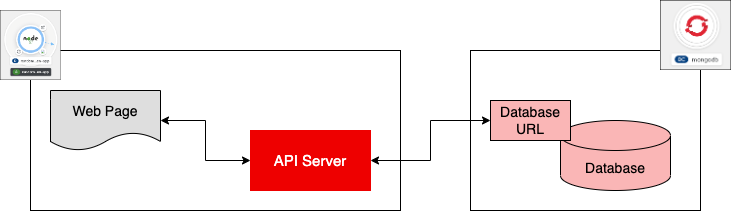

## **Devops Tools**


### Get the oc client download URL

Go to this [link](https://github.com/openshift/okd/releases) to get your desired version of the OC client tool. I have choosen the latest version available in July, 2020.

https://github.com/openshift/okd/releases/download/4.5.0-0.okd-2020-07-14-153706-ga/openshift-client-linux-4.5.0-0.okd-2020-07-14-153706-ga.tar.gz

### Download the package

```bash
wget https://github.com/openshift/okd/releases/download/4.5.0-0.okd-2020-07-14-153706-ga/openshift-client-linux-4.5.0-0.okd-2020-07-14-153706-ga.tar.gz
```

### Extract the package

```bash
tar -xvf openshift-client-linux-4.5.0-0.okd-2020-07-14-153706-ga.tar.gz
```

### Move oc and kubectl file to your expected directory

```bash
sudo mv oc kubectl /usr/local/bin/
```

### Now you can start using OC command

```bash
oc version
```

**You may need to add the installation path in your bash profile**

### **working with db using OpenStack oc CLI**

'


```bash
oc create -f 
https://raw.githubusercontent.com/openshift-labs/starter-guides/ocp-4.8/mongodb-template.yaml -n {your-namespace}
```
```bash
oc new-app --template=mongodb-ephemeral --param MONGODB_USER=genuser --param MONGODB_PASSWORD=password --param MONGODB_DATABASE=namegen --param NAMESPACE={your-namespace}
```

```bash
oc import-image mongodb:3.6 
--from=registry.access.redhat.com/rhscl/mongodb-36-rhel7 --confirm -n {your-namespace}
```

### About these parameters:

**--template=mongodb-persistent**  declares the OpenShift template to use, in this case the mongodb-persistent template. The mongodb-persistent template creates a Kubernetes persistent volume claim (PVC) for storing database data. The data stored in the PVC will remain available even if the instance of the MongoDB database is removed from the Developer Sandbox for Red Hat OpenShift. 

**--param=MONGODB_USER=genuser** declares the name of the MongoDB user who will be reading and writing to the instance of the MongoDB database running in the Developer Sandbox for Red Hat OpenShift. 
**--param=MONGODB_PASSWORD=password** declares the password for the MongoDB user who will be reading and writing to the instance of the MongoDB database running in the Developer Sandbox for Red Hat OpenShift. 
**--param=MONGODB_DATABASE=namegen** declares the name of the database in the MongoDB instance that will be created to store data for the demonstration application.

### **Installing the OpenShift Pipelines Operator using the CLI**

```yaml

apiVersion: operators.coreos.com/v1alpha1
kind: Subscription
metadata:
  name: openshift-pipelines-operator
  namespace: openshift-operators
spec:
  channel:  <channel name> 
  name: openshift-pipelines-operator-rh 
  source: redhat-operators 
  sourceNamespace: openshift-marketplace 

  ```


