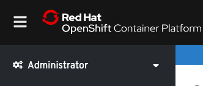
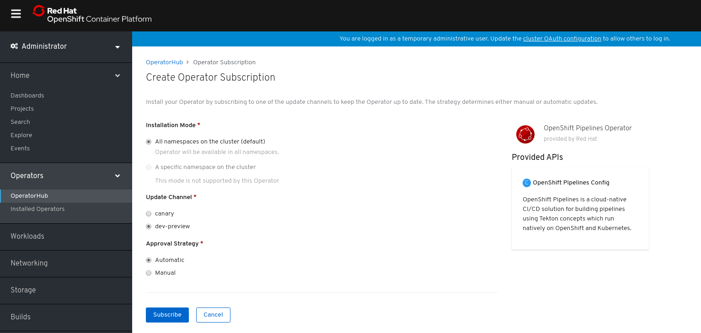
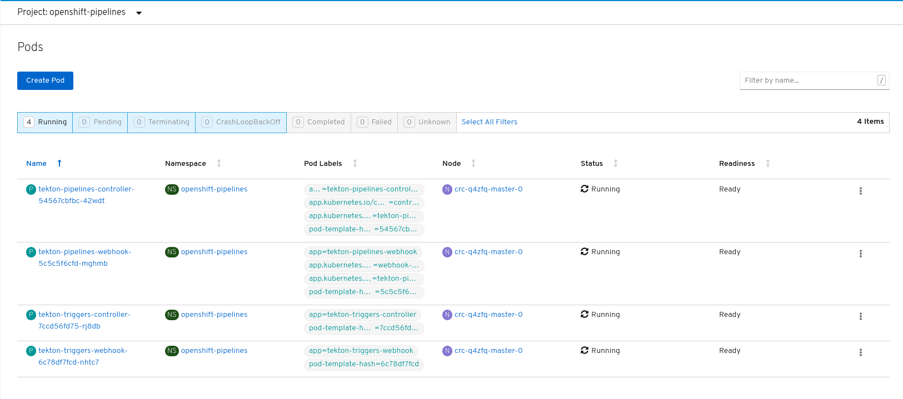

# Install OpenShift Pipelines

OpenShift Pipelines is provided as an add-on on top of OpenShift that can be installed via an operator that is available in the OpenShift OperatorHub.

To start, make sure you are on the **Administrator** perspective as shown below:

Go to **Operators > OperatorHub** in the Web Console. You can see the list of available operators for OpenShift provided by Red Hat as well as a community of partners and open-source projects.

In the search bar where it says `Filter by keyword...`, type OpenShift Pipelines to find the **OpenShift Pipelines Operator**:

Click on **OpenShift Pipelines Operator**, **Continue**, and then **Install**:

Leave the default settings and click on **Subscribe** in order to subscribe to the installation and update channels:

After clicking **Subscribe**, you will be taken to the **Installed Operators** page. If you do not see the **OpenShift Pipelines Operator** as shown below, simply wait a moment while the **OpenShift Pipelines Operator** finishes installation:

That's all. The operator now installs OpenShift Pipelines on the cluster.

You can confirm the following by checking tekton-pipelines and tekton-triggers pods with `Running` state in `openshift-pipelines` namespace. If so, openshift-pielines have been installed on your cluster.

